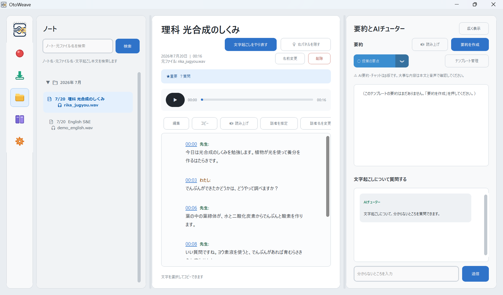
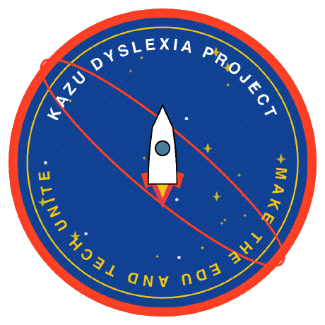

<p align="center"></p>

# OtoWeave（オトウィーヴ）

**音を織り上げ、理解できる学びへ。**
*Weave Speech into Understanding.*

読み書きが苦手でも、授業についていける。完全オフラインで動くAIノートアプリ。



[](LICENSE)
[-lightgrey)](#対応os・必要スペック--supported-os--specs)
[](#プライバシーを重視した設計)
[](#対応os・必要スペック--supported-os--specs)
[](#開発状況)

[English summary below](#english)

## 現在できること / What it does

| | 機能 | 説明 |
|---|---|---|
| ✅ | 文字起こし | 授業・会議・面談の音声を日本語・英語・日英混在でテキスト化 |
| ✅ | 話者分離 | 誰が話したかを推定し、話者ごとに色分け表示（名前も変更可） |
| ✅ | AI要約（β） | 用途別テンプレートでローカルAIが要約を生成。誤りの可能性を常に明示 |
| ✅ | 読み上げ | 文字起こし・要約をWindows標準音声で読み上げ、タイムスタンプから聞き直し |
| ✅ | 完全オフライン | 録音も文字起こしも要約も、すべて端末内で完結。外部送信の仕組みなし |

## しくみ / How it works


## 対応OS・必要スペック / Supported OS & Specs

| 項目 | 内容 |
|---|---|
| OS | Windows 10 / 11（64bit） |
| メモリ | 8GB以上推奨（文字起こし・チャット・読み上げ） |
| メモリ（AI要約を使う場合） | 12GB以上推奨 |
| メモリ（上位モデルでの要約） | 16GB以上 |
| GPU | 不要（CPUのみで動作） |
| macOS（Apple Silicon） | テスト版（`mac-port-m2` ブランチ）。M1/M2/M3・8GB RAM級を想定し検証中 |

セットアップ時に空き容量とメモリを自動判定し、AI要約を「使う設定」にするか「使わない設定（モデルを削除して節約）」にするかを自動で決めます。判定結果は `setup_report.txt` に記録されます。

## 試し方 / How to try

**かんたんセットアップ（推奨）** — スクリプトを1つ実行するだけです。AIモデル（メモリ8GB級のPCで約1.2GB、12GB以上で約5GB）は公式配布元から自動ダウンロードされます。

**gitを使わない場合（いちばん簡単）:**
1. [ZIPをダウンロード](https://github.com/badge-k2so/otoweave/archive/refs/heads/main.zip)して展開する（gitのインストールは不要です）
2. 展開したフォルダ内の `distribution\setup_easy.ps1` を右クリック →「PowerShellで実行」
   （またはPowerShellで `powershell -ExecutionPolicy Bypass -File .\distribution\setup_easy.ps1`）

**gitを使う場合:**
```powershell
git clone https://github.com/badge-k2so/otoweave.git
cd otoweave
powershell -ExecutionPolicy Bypass -File .\distribution\setup_easy.ps1
```

初回はモデルのダウンロードに時間がかかります（回線速度に依存）。完了すると起動方法が表示されます。必要なもの: Windows 10/11 とインターネット接続だけ（curl・tar は Windows 標準搭載、Python はスクリプトが導入を案内します）。

その他の入手方法:
- **テスター向け配布パッケージ**: モデル・依存関係を同梱したオフラインセットアップ版（インターネット不要）。テスト参加のご希望は [Issues](https://github.com/badge-k2so/otoweave/issues) へ
- **macOS（テスト版）**: `mac-port-m2` ブランチ + [Macテスト手順書](https://github.com/badge-k2so/otoweave/blob/mac-port-m2/distribution/docs/Macテスト手順書.md)

詳しい手順・トラブル対応は以下のドキュメントにまとまっています。

- [はじめにお読みください](distribution/はじめにお読みください.txt) — セットアップと起動の全手順
- [テスト手順書](distribution/docs/テスト手順書.md) / [フィードバックシート](distribution/docs/フィードバックシート.md)
- [データの取り扱いと確認方法](distribution/docs/データの取り扱いと確認方法.md) — 外部送信がないことを自分で確認する方法
- [モデル構成](distribution/docs/モデル構成.md) — 使用しているAIモデルと選定理由

## プロジェクトについて / About the project



OtoWeave は **KAZU DYSLEXIA PROJECT — Make the Edu and Tech Unite** の一環として開発されています。読み書きに困難のある学習者を、教育とテクノロジーの力で支えることを目指すプロジェクトです。

<br clear="left">

## こんな人のために / Who this is for

読むこと・書くことに困難があっても、聞いて理解する力がある子ども・生徒のためのアプリです。授業中は聞くことに集中し、あとから文字起こし・話者分けされたノートと要約、読み上げで振り返ることができます。教師・保護者・学習支援に関わる方向けに、専門用語を使わない説明を [docs/for-educators.md](docs/for-educators.md) にまとめました。導入や仕組みについて相談したい場合は、GitHub の [Issues](https://github.com/badge-k2so/otoweave/issues) からご連絡ください。

---

## 詳細 / Details

> 読み書きの負担を減らし、「聞いて理解する」ことを支える、オフライン完結型の AI ノートアプリです。

### 日本語

OtoWeave は、ディスレクシア（読み書き困難）のある人が、授業・会議・面談などで話を聞きながらノートを取る負担を減らすためのデスクトップアプリです。

録音、文字起こし、話者分離、AI 要約、質問応答、読み上げまでをローカル PC 上で処理します。音声や文字起こしをクラウド AI API へ送信せず、インターネットに接続できない環境でも利用できることを重視して開発しています。

#### 解決したい課題

話を聞きながら板書やメモを書くこと、後から長い文字起こしを読むことは、読み書きに困難のある人にとって大きな負担になることがあります。OtoWeave は、次の流れを一つのアプリにまとめることで、「書く負担」と「読む負担」の両方を減らします。

```text
録音 → 文字起こし → 話者分離 → 要約 → 読み上げ・聞き直し
```

#### 主な機能

- 日本語・英語・日英混在音声の文字起こし
- マイク録音、PC 再生音の録音、既存音声ファイルの取り込み（対応8音声形式: OGG/WAV/MP3/M4A/Opus/FLAC/AAC/WMA）
- 発話者の推定、話者ごとの色分け、話者名の変更
- 授業・会議・面談など、用途別テンプレートによるローカル AI 要約（β版）
- 選択したノートの内容について質問できるローカル AI チューター（β版）
- 文字起こしと要約の読み上げ、およびタイムスタンプからの音声再生
- 「重要」「あとで確認」「質問」のマーキング
- 補正辞書、ノート検索、文字起こしの編集と訂正履歴
- UD フォント、文字サイズ、行間、読書幅、ライト／ダークモードなどの表示設定
- 自動バックアップ、破損検出、ごみ箱方式による削除など、記録を失いにくい保存設計

#### プライバシーを重視した設計

- 音声認識、話者分離、要約、チャット、読み上げを端末内で実行
- クラウド AI API、テレメトリ、アクセス解析、自動同期を使用しない設計
- 音声、文字起こし、要約、マーク、訂正履歴をローカルに保存

録音を行う際は、利用する場所のルールを確認し、必要に応じて参加者の同意を得てください。

#### 実測値（開発機 i5-1145G7、4スレッド）

- 文字起こし: 71分音声 → 約5分
- 話者分離（プロトタイプ）: 71分音声 → 約12.4分
- テスト: 自動テスト573本
- Celeron級の低スペック機ではより時間がかかる可能性があります（未実測）

#### 使用技術

- Python / CustomTkinter
- ReazonSpeech K2（日本語音声認識）
- NVIDIA Parakeet TDT（英語音声認識）
- SpeechBrain（言語判定）
- pyannote segmentation / 3D-Speaker（話者分離）
- Qwen GGUF / llama-cpp-python（要約・チャット）
- Windows System.Speech（読み上げ）

#### 開発状況

OtoWeave は現在、プロトタイプとして開発・検証中です。AI 要約と AI チューターはβ版であり、生成結果には誤りや情報の欠落が含まれる可能性があります。重要な内容は、必ず元の文字起こしと音声で確認してください。

詳しい機能、セットアップ方法、保存形式、検証用スクリプトについては、[プロジェクト詳細 README](docs/development.md) を参照してください。

#### ライセンス

このリポジトリのソースコードは [MIT License](LICENSE) で公開しています。利用する AI モデルや外部コンポーネントには、それぞれ個別のライセンスが適用されます。

---

## English

> A fully offline AI note-taking application designed to reduce reading and writing demands and help people focus on listening and understanding.

OtoWeave is a desktop application for people with dyslexia and other reading or writing difficulties. It is designed to reduce the effort required to take notes while listening during classes, meetings, interviews, and support sessions.

Recording, transcription, speaker diarization, AI summarization, question answering, and text-to-speech are processed locally on the PC. Audio and transcripts are not sent to cloud AI APIs, and the application is designed to remain usable without an internet connection.

### The problem OtoWeave addresses

Listening while copying from a board or writing notes—and later reading a long transcript—can create a significant barrier for people with reading and writing difficulties. OtoWeave brings the complete workflow into one application to reduce both writing and reading demands:

```text
Record → Transcribe → Identify speakers → Summarize → Listen and review
```

### Key features

- Transcription for Japanese, English, and mixed Japanese-English audio
- Microphone recording, system-audio capture, and existing audio-file import (8 formats: OGG/WAV/MP3/M4A/Opus/FLAC/AAC/WMA)
- Speaker estimation, color-coded speakers, and customizable speaker names
- Local AI summaries using templates for classes, meetings, and interviews (beta)
- A local AI tutor for asking questions about the selected note (beta)
- Text-to-speech for transcripts and summaries, plus timestamp-based audio playback
- One-click markers for important points, items to review, and questions
- A correction dictionary, note search, transcript editing, and correction history
- Accessible display options including UD fonts, text size, line spacing, reading width, and light/dark themes
- Resilient local storage with automatic backups, corruption detection, and recoverable deletion

### Privacy-first design

- Speech recognition, diarization, summarization, chat, and text-to-speech run on the device
- No cloud AI APIs, telemetry, analytics, or automatic synchronization by design
- Audio, transcripts, summaries, markers, and correction history remain in local storage

Before recording, check the rules that apply in your school, workplace, or region and obtain participant consent when required.

### Measured performance (dev machine: i5-1145G7, 4 threads)

- Transcription: a 71-minute recording in about 5 minutes
- Speaker diarization (prototype): a 71-minute recording in about 12.4 minutes
- 573 automated tests
- Lower-spec machines (e.g., Celeron-class) are expected to be slower (not yet measured)

### Technology

- Python / CustomTkinter
- ReazonSpeech K2 for Japanese speech recognition
- NVIDIA Parakeet TDT for English speech recognition
- SpeechBrain for language identification
- pyannote segmentation / 3D-Speaker for speaker diarization
- Qwen GGUF / llama-cpp-python for summaries and chat
- Windows System.Speech for text-to-speech

### Project status

OtoWeave is currently a prototype under active development and testing. AI summaries and the AI tutor are beta features and may contain errors or omit information. Always verify important details against the original transcript and audio.

For detailed features, setup instructions, storage formats, and testing scripts, see the [project documentation](docs/development.md).

### License

The source code in this repository is available under the [MIT License](LICENSE). AI models and third-party components are subject to their respective licenses.
